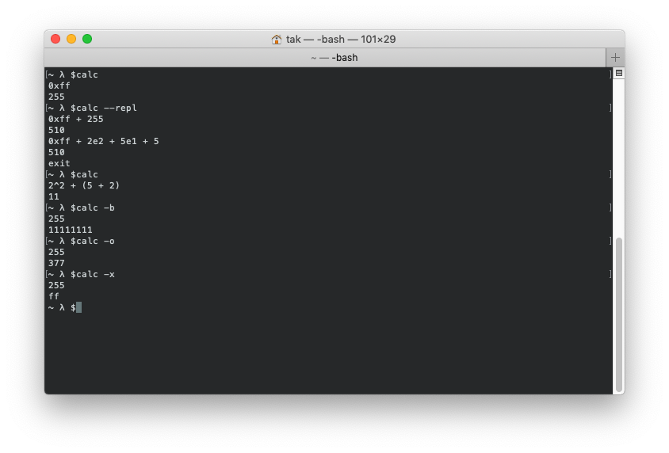

# calc

A simple and slick calculator for your terminal.



## Usage

```
usage: calc [options]
-h  --help           print this usage and exit
-v  --version        print version information and exit
-r  --repl           use read-eval-print loop mode
-t  --tree           print the syntax tree
-b  --output-binary  print the result in binary
-o  --output-octal   print the result in octal
-x  --output-hex     print the result in hexidecimal
```

## Installation

```bash
# To compile, run make
make
# Change the permissions
chmod +x ./calc
# Move it to the bin folder
sudo mv ./calc /usr/local/bin/
# Install the man page
make man

# or to perform all the tasks above
make install

# To remove the man page and calc, just run:
make uninstall
```

## Description

calc is a simple and slick calculator for your terminal. 
This calculator supports the basic operators such as `+`, `-`, `*`, `/`, as well as
the advanced operators `%`, and `^`. In addition, calc also supports scientific notation like
`1e4`, `2.34e2`, etc. Lastly, calc can also print the abstract syntax tree in Lisp format.

## Operators

|  Operator  |                Description                  | Precedence |
|------------|---------------------------------------------|------------|
|    `^`     | Raises a number to the power of the `n`     |     1      |
|    `+`     | Adds two numbers                            |     4      |
|    `-`     | Subtracts two numbers or negates a number   |     4      |
|    `-`     | Negates a number                            |     2      |
|    `*`     | Multiplies two numbers                      |     3      |
|    `/`     | Divides two numbers                         |     3      |
|    `%`     | Returns the remainder of two numbers        |     3      |
| `~`, `not` | Bitwise *not* a number                      |     2      |
| `&`, `and` | Bitwise *and* two numbers                   |     5      |
| `\|`, `or`  | Bitwise *or*  two numbers                   |     6      |
| `\`, `xor`| Bitwise *xor* two numbers                   |     7      |

> Note: Groupings *`(expression)`* have a precedence level of 0
